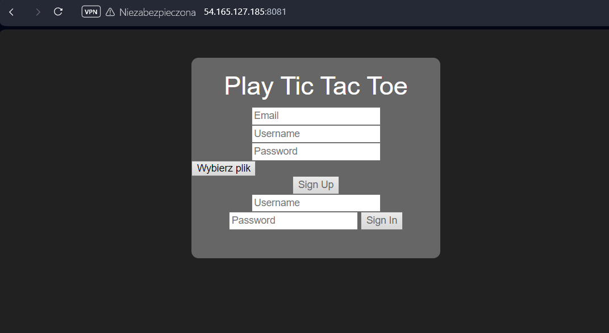
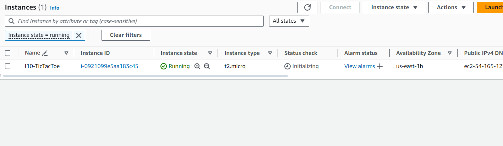
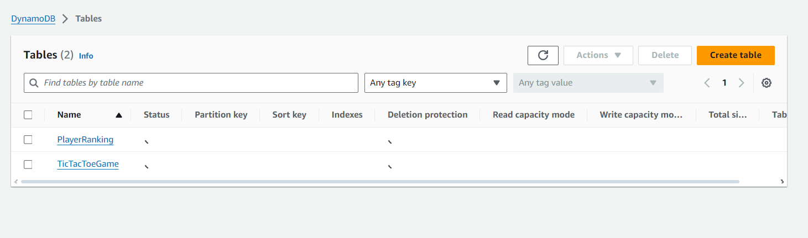
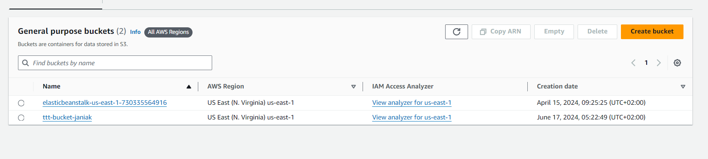
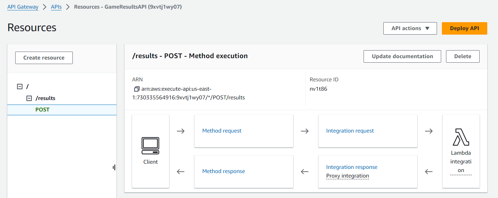
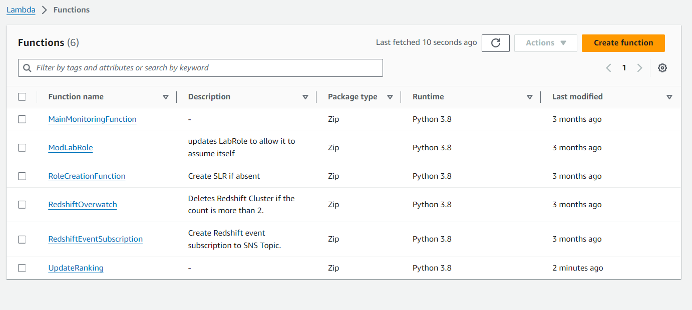

# Łukasz Janiak - A12 report

- Course: *Cloud programming*
- Group: Poniedziałek 9:15
- Date: 17-06-2023

## Environment architecture

Części architektury:
- EC2 - aplikacja webowa na dwóch kontenerach (frontend, backend)
- S3 - przechowywanie zdjęć profilowych użytkowników (komunikacja ze strony backendu)
- DynamoDB - przechowyanie historii gier oraz rankingu (komunikacja ze strony backendu oraz Lambdy)
- API Gateway - endpoint umożliwiający przesłanie gry do przeprocesowania na rzecz rankingu
- Lambda - przeliczanie meczy na rzecz rankingu (wywoływane przez API Gateway)

## Preview

Screenshots of configured AWS services. Screenshots of your application running.

## Reflections

- Czego nowego się nauczyliście?

    Nauczyłem się integrować aplikacje webowe z usługami AWS, takimi jak S3, DynamoDB, API Gateway oraz Lambda.
- Jakie problemy napotkaliście w zadaniu?

    Podjąłem próbę połączenia aplkacji Spring Boot z usługą DynamoDB poprzez adnotacje (https://www.baeldung.com/aws-lambda-dynamodb-java). Niestety okazał się to niewypał i finalnie "ręcznę" obsłużenie tej usługi sprawdziło się. 

    Problemem okazała się również integracja z usługą S3. Próbowałem to zrobić na poziomie backendu (nie udało się ze względu na braki w uprawnieniach - wymagane było stworzenie Identity Pool-a). Rozwiązaniem okazało przeniesienie tej funkcjonalności na backend(gdzie nie było problemu z uprawnieniami).

- Dlaczego wybraliście akurat tą bazę danych?

   Zdecydowałem się na DynamoDB gdyż oferuje ono skalowalność(przydatne w przypadku populazryzacji aplikacji), niski czas odpowiedzi (dzięki czemu rankingi oraz historgia gier będą jak najbardziej odzwierciedlały rzeczywistość) oraz elastyczny model danych (aplikacja jest jeszcze we wstępnym etapie rozwoju, a elastyczność ułatwi przyszłe modyfikacje bazy bez utraty danych).